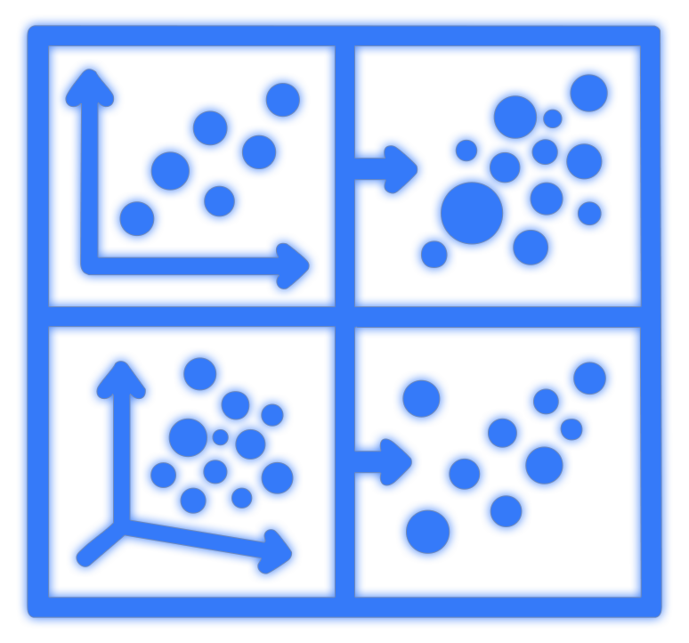

# <span style="color: #357AFA;">AnnZarro</span> 

[](https://www.python.org/downloads/)
[](LICENSE)

AnnZarro is a modern single-cell data visualization tool for analyzing AnnData objects stored in zarr format. It features a browser-based interface with a lightweight Python backend and can be used as either a web application or standalone desktop app.

## Key Features

- **Interactive Visualization** - Scatter plots, heatmaps and tables using plotly.js
- **Comprehensive AnnData Support** - Access all components (.obs, .var, .obsm, .varm, .obsp, .varp, .layers)
- **Efficient Data Handling** - Lazy loading and sparse matrix support for large datasets
- **Flexible Access** - Local files, HTTP, or S3 connectivity
- **Desktop Application** - Standalone cross-platform electron app

## Installation & Usage

### Quick Start

```bash
# Clone the repository
git clone https://github.com/settylab/annzarro.git
cd annzarro

# Install dependencies (uses virtual environment by default)
./annzarro-cli install

# Start the server
./annzarro-cli start

# Or run the desktop app
./annzarro-cli desktop run
```

Then open http://localhost:8000 in your browser if using server mode.

### Installation Options

```bash
# Install without virtual environment
./annzarro-cli install --no-venv

# Clean reinstall 
./annzarro-cli install --clean

# Use standalone installer directly
python annzarro-install.py

# Skip optional dependencies
./annzarro-cli install --no-extras
```

### Server Commands

```bash
# Start with custom settings
./annzarro-cli start --port 8080 --data-dir /path/to/data

# Run in background
./annzarro-cli start --detach

# Stop the server
./annzarro-cli stop

# Manage users
./annzarro-cli user add
./annzarro-cli user add --admin       # may delete/overwrite anyone's panel sets
./annzarro-cli user list
./annzarro-cli user remove --username username
```

### Sharing a Server: Login and Permissions

AnnZarro never writes your datasets. The only thing users write is **panel
sets**, saved as JSON in `<data-dir>/sessions/` and visible to every user of the
server.

- **Login** is required automatically when the server binds to anything other
  than `127.0.0.1`/`localhost`. `--auth-disabled` (or `ANNZARRO_AUTH_DISABLED`)
  turns it off; doing that on a network address logs a `SECURITY` warning at
  startup and shows a "No login" badge in the header, because anyone who can
  reach the port can then open any dataset the server can read and delete
  every panel set. Set `auth.secret_key` to a long random value: the shipped
  placeholder lets anyone forge a login cookie.
- **With login**, everyone can load, export and duplicate any panel set and
  save new ones. Deleting, renaming, or saving/importing **over** an existing
  set is allowed only to the user who first saved it (its owner, recorded in
  the file) and to **admins** (`user add --admin`). Sets saved before owners
  were recorded can only be changed by an admin.
- **Without login** (local, single-user) there are no restrictions.

### Desktop Application

```bash
# Run desktop app
./annzarro-cli desktop run

# Build for distribution
./annzarro-cli desktop build --platform [windows|mac|linux]
```

## Working with Data

Add datasets by copying or linking .zarr directories to the data/ folder:

```bash
# Copy a dataset
cp -r /path/to/your-dataset.zarr data/

# Or create a symlink
ln -s /path/to/your-dataset.zarr data/

# Use a custom data directory
./annzarro-cli start --data-dir /path/to/datasets
```

## Development

```bash
# Run tests
python -m pytest

# Start in development mode
./annzarro-cli start --development
```

## Architecture

- **Frontend**: Pure JavaScript with plotly.js and DataTables
- **Backend**: Flask-based REST API with comprehensive zarr support
- **Desktop**: Electron application with integrated Python server

## Download

Get the latest desktop app for your platform:

- [Windows](https://github.com/settylab/annzarro/releases/latest/download/AnnZarro-Setup.exe)
- [macOS](https://github.com/settylab/annzarro/releases/latest/download/AnnZarro.dmg)
- [Linux](https://github.com/settylab/annzarro/releases/latest/download/AnnZarro.AppImage)

### Creating a new release

To create a new release with desktop apps for all platforms:

1. Update version in `annzarro/desktop/electron/package.json`
2. Create and push a new tag:
   ```bash
   git tag v0.1.1
   git push origin v0.1.1
   ```
3. GitHub Actions will automatically build the desktop apps and create a release

## License

GPL-3.0-or-later
